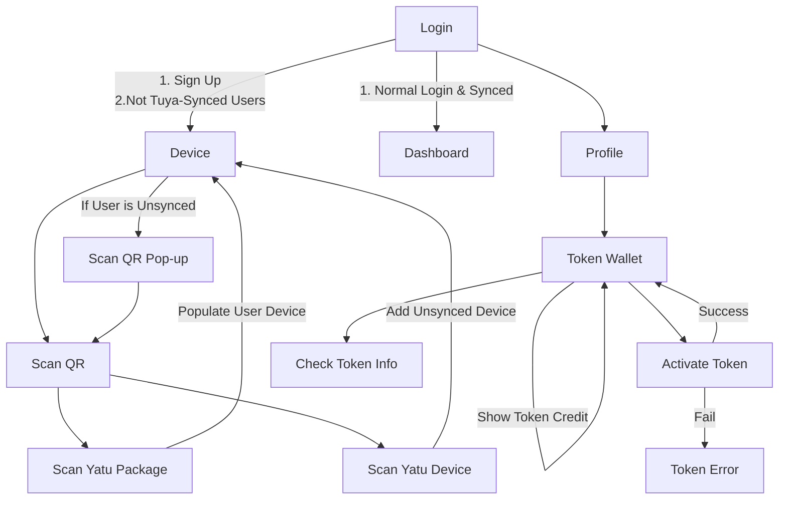

# Flow

## Chart

## Flow 1: Authenticate  

1. Register with new account.
2. DO you have smart life or Tuya app? (follow yours existing)
3. If yes, then go ask them have account? is it same
4. If No, redirect them to App Store or play store download.
5. Proceed with Authenticate,
6. after done authenticate, grey up all, enforce them activate Yatu package token
7. show them how to get token (link Shopee Lazada with button)
8. after they activate, no need let them tick or untick.
9. add a sync button on top let them download today and yesterday data.

## Flow 2: Activate token first

1. Register with new account.
2. 6 grey up all, enforce them activate yatu package token
3. show them how to get token (link Shopee Lazada with button)
4. after they activate, no need let them tick or untick. grey it up
5. grey up ask them DO you have smart life or tuna app? (follow yours existing)
6. If yes, then go ask them have account? is it same
7. If No, redirect them to App Store or play store download.
8. Proceed with Authenticate,
9. after done authenticate, add a sync button on top let them download today and yesterday data.

## Task List

- [x] Wash Cup, Make Cup of Coffee
- [x] Insert Yatu Devices
  - [x] Differentiate between Known Devices & Unknown Devices
  - [x] Sub User Access Based on Token
  - [x] Do Tokens Add On To Each Other?
- [x] Activate & Disable Devices
  - [x] TUser Based on Device Qty
- [x] Insert TDevice_Yatu

## API

- [x] GetTokenDetails from token
  - [x] Temp: GetParamApi
- [x] GetDeviceByUserII
- [x] ActivateYatuPackage
  - [x] Insert To Tokens
  - [x] Insert To Device Yatu
    - [x] Insert API
  - [x] C#
  - [x] `ActivateYatuPackage` `fetchActivateYatuPackage`

  - [x] Auto Pop-up
    - [x] When Sign up for First Time
  
  - [ ] Change Image to Temperate & Humidity
  
  - [x] Link Api
    - [x] `fetchActivateYatuPackage`
    - [x] `GetDeviceByUserII`

  - [x] Authenticate Account With Yatu
    - [x] Make Into Components

  - [x] For Free Version, Sync all of Device Data
    - [x] Lock Account If Device Qty is 0 (=> No Tokens)

  - [ ] Fix CheckTuyaAccount (Optional) (Pray that it doesnt crash)
