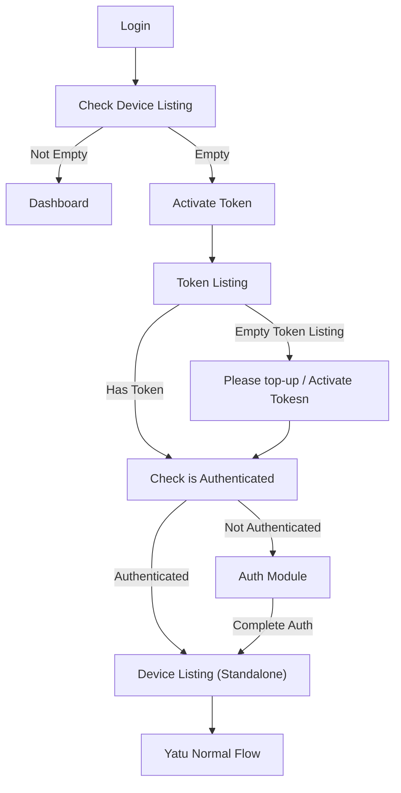

# Yatu List

## Variables

* Membership
* Expiry Date
* Deivce Quantity

## Business Rules

* Set 20 Device for Default User
  * Show Device Count at Device Listing
  * If Max Device, Unable to Sync
* Token Redemption, Determine Member Type
  * Types:
    * Normal Device: 20 User
    * 50 Device User
  * Once redeemed, unable to refund
  * If token expired, need to redeem again
  * Token Package:
    * 1 Month
    * 3 Month
    * 6 Month
    * 1 Year

## Flowchart

