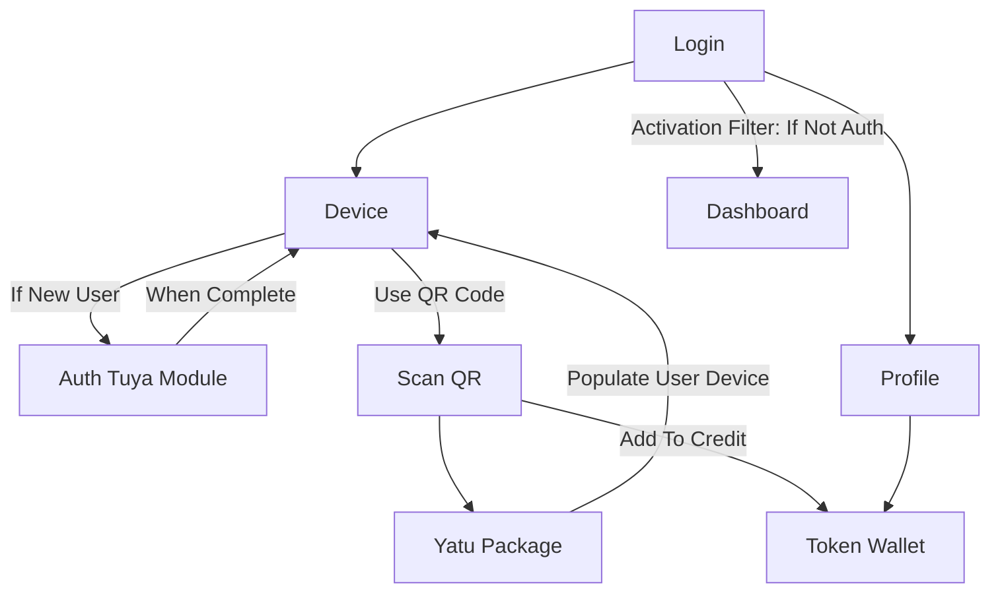
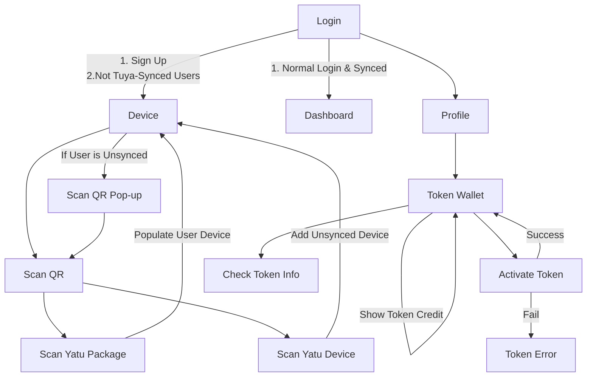

# Flow Chart

Embed JSON Data Into QRCode:

1. Individual QR
2. Group QR

# Thoughts

When I Scan Json, it should populate

* Device List
  * Smart Plug
  * Temp & Humd
  * Air Quality

## Yatu Lite

1. When User Login to Yatu Lite App, it will ask for User Email & OTP code
2. When User input correct email & OTP Code, User will create a Yatu Account and Go To Empty Device Listing Page
3. If User first time login, a tutorial will show user how to use Yatu App
   1. The Tutorial will show User to scan their newly bought Yatu Package from Shopee / Lazada, using Yatu QR Scanner
4. When User Scan the Yatu Package, it will add the devices BUT will blocked the device with a blur filter
   1. The filter will be removed when the system has sync with SmartLife app.
   2. The filter will ask user to check SmartLife app for sync status
5. If User has not authenticate with Yatu Package, a blur filter will ask User to complete Authentication process.
   1. Unauthenticated User can only view Yatu Viewer, Yatu Profile & Yatu device. They cannot view Yatu Dashboard

## Packages

- [x] Check Installed Apps
  - [x] Directly Open SmartLife / Tuya App in Google Play Store
  - [ ] Directly Open SmartLife / Tuya App in App Store
- [ ] React Native QR Scanner
s
- [x] react-native-app-link
- [x] react-native-qrcode-scanner

## Tasks

- [x] Summarize Meeting 2024-01-26
- [ ] Scan QR Code to Auto Insert Device
  - [ ] Delete All When Syncing Devices
  - [ ] Filter to show Account is not authenticated, so ask them to authenticate
